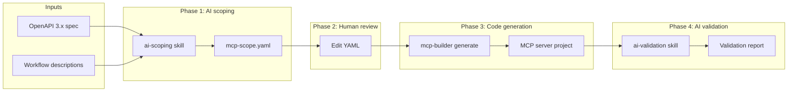

# mcp-builder

A pipeline for generating ToolHive-ready MCP servers from OpenAPI specs.

## Why it exists

Wrapping an OpenAPI spec as an MCP server one-for-one doesn't work: enterprise
APIs expose hundreds of endpoints, auto-generated names like
`drives_files_list_v2` tell an LLM nothing, and parameter docs are written for
developers instead of models. `mcp-builder` curates the spec into a short YAML
contract (`mcp-scope.yaml`), then deterministically generates a complete
ToolHive-ready server from that contract. AI assists at the edges (scoping and
validation); the code generator itself is plain Python with no model in the
loop. See the [RFC](docs/rfc-custom-mcp-server-builder.md) for the full design.

## Quick start

### Install the CLI

Requires Python 3.13+ and [uv](https://docs.astral.sh/uv/).

```bash
git clone https://github.com/StacklokLabs/mcp-builder.git
cd mcp-builder
uv sync
```

Run `uv run mcp-builder --help` to see the full list of CLI commands.

### Install the AI skills and agents

Phases 1 and 4 (and the optional deploy step) are driven by AI skills that
live in `skills/`. The skills spawn sub-agents from `agents/` (for spec
analysis, tool scoping, validation, and polish). Both need to be visible to
your AI coding tool. Symlinking from the repo keeps them in sync with
`git pull`.

**Claude Code** — symlink the skills into `.claude/skills/` and the agents
into `.claude/agents/` (project-level). Swap `.claude/` for `~/.claude/`
to install at the user level (available everywhere) instead.

```bash
mkdir -p "$(pwd)/.claude/skills" "$(pwd)/.claude/agents"

# Skills
ln -s "$(pwd)/skills/ai-scoping"    "$(pwd)/.claude/skills/ai-scoping"
ln -s "$(pwd)/skills/ai-validation" "$(pwd)/.claude/skills/ai-validation"
ln -s "$(pwd)/skills/deploy-assist" "$(pwd)/.claude/skills/deploy-assist"

# Agents
ln -s "$(pwd)/agents/spec-analyzer.md"    "$(pwd)/.claude/agents/spec-analyzer.md"
ln -s "$(pwd)/agents/endpoint-scoper.md"  "$(pwd)/.claude/agents/endpoint-scoper.md"
ln -s "$(pwd)/agents/code-validator.md"   "$(pwd)/.claude/agents/code-validator.md"
ln -s "$(pwd)/agents/polish-suggester.md" "$(pwd)/.claude/agents/polish-suggester.md"
```

Once installed, the skills appear as slash commands: `/ai-scoping`,
`/ai-validation`, `/deploy-assist`.

**Gemini CLI** — Gemini CLI supports skills at `.gemini/skills/` and
sub-agents at `.gemini/agents/` (swap for user-level `~/.gemini/...` if
you prefer). The install is symmetric with Claude Code:

```bash
mkdir -p "$(pwd)/.gemini/skills" "$(pwd)/.gemini/agents"

# Skills
ln -s "$(pwd)/skills/ai-scoping"    "$(pwd)/.gemini/skills/ai-scoping"
ln -s "$(pwd)/skills/ai-validation" "$(pwd)/.gemini/skills/ai-validation"
ln -s "$(pwd)/skills/deploy-assist" "$(pwd)/.gemini/skills/deploy-assist"

# Agents
ln -s "$(pwd)/agents/spec-analyzer.md"    "$(pwd)/.gemini/agents/spec-analyzer.md"
ln -s "$(pwd)/agents/endpoint-scoper.md"  "$(pwd)/.gemini/agents/endpoint-scoper.md"
ln -s "$(pwd)/agents/code-validator.md"   "$(pwd)/.gemini/agents/code-validator.md"
ln -s "$(pwd)/agents/polish-suggester.md" "$(pwd)/.gemini/agents/polish-suggester.md"
```

Gemini CLI also ships `gemini skills link <path>`, which auto-discovers and
symlinks SKILL.md files if you'd rather not do it by hand.

### Run the pipeline

The pipeline has four phases plus an optional deploy step. Phases 1 and 4
(and deploy) run inside your AI coding tool via the skills above. Phases 2
and 3 are CLI steps you run at the terminal.

> **You are responsible for runtime testing.** The pipeline validates
> *structure* — tool coverage, HTTP methods, manifest shape, auth *wiring*.
> It does not exercise the server against the real API. **Auth especially
> must be verified by you**: specs misrepresent auth more often than
> anything else, and a server that compiles and passes structural checks
> can still fail the first real token exchange. Plan to run the built
> image against the live API with real credentials before declaring any
> server done.

Example specs live in `e2e/fixtures/` (Google Drive, GitHub, Jira,
BambooHR, Stripe, Slack, and more) if you want something to try against.

---

#### Phase 1 — Scope the API (AI)

1. Launch your AI coding tool (Claude Code or Gemini CLI).

2. Run the scoping skill:

   ```
   /ai-scoping <path-to-openapi-spec>
   ```

3. Work through the skill's review gates: spec analysis, endpoint grouping,
   tool naming, description writing, and auth detection. The skill pauses
   at each gate for your approval.

4. **Verify the detected auth at the auth gate.** The skill maps OpenAPI
   security schemes to ToolHive auth types, but it is inferring — not
   observing. Before confirming, check:

   - **Auth type** is correct (`oauth2`, `oidc`, `api_key`, etc.).
   - **Issuer / token URL** is reachable and has no template placeholders
     (e.g. `{companyDomain}`).
   - **Scopes** match what your workflows actually need.
   - **Header name** for API keys matches what the API expects.

   If the skill flagged a discovery-doc warning, read it. Upstream IdPs
   that publish non-compliant docs need `type: oauth2` with explicit
   endpoints — not `type: oidc`.

**Outputs:**
- `mcp-scope.yaml` — the curated contract the generator consumes.
- `scoping-summary.md` — explanation of the AI's choices.

---

#### Phase 2 — Human review (you)

1. Open `mcp-scope.yaml` alongside `scoping-summary.md`.

2. Review tool groups, names, descriptions, and hints. Edit freely.

3. **Re-verify the `auth:` block.** This is your last chance before code is
   generated around it. Confirm `auth.type`, endpoints, scopes, and any
   header names one more time.

4. *(Optional)* If you made substantial edits, re-run validation:

   ```bash
   uv run mcp-builder validate path/to/mcp-scope.yaml path/to/openapi.yaml
   ```

   The scoping skill already validated once before handoff, so a clean
   YAML does not strictly need this step.

---

#### Phase 3 — Generate the server (CLI)

1. **One-time setup:** clone `mcp-template-py` somewhere on disk.

   ```bash
   git clone https://github.com/StacklokLabs/mcp-template-py.git ../mcp-template-py
   ```

2. Generate the server:

   ```bash
   uv run mcp-builder generate \
       path/to/mcp-scope.yaml \
       path/to/openapi.yaml \
       ../mcp-template-py \
       --output-dir ./out
   ```

This step is fully deterministic — no AI in the loop. Output is a complete
MCP server project plus ToolHive deployment manifests in `./out`.

---

#### Phase 4 — Validate and polish (AI + you)

1. Launch your AI coding tool and run:

   ```
   /ai-validation <generated-project-dir> <scope-yaml> <spec-path>
   ```

2. The skill performs structural and behavioral checks (every scoped tool
   is present, HTTP methods match the spec, auth is wired correctly),
   builds the Docker image, and suggests improvements driven by scope
   hints (response shaping, pagination, API quirks).

3. **Runtime-test the server yourself.** The skill does not make a live
   API call — structural checks do not cover runtime behavior.

   - Run the generated server locally (`task run` from the generated
     project; see its README for the exact command, port, and env vars).
   - Connect with the [MCP
     Inspector](https://github.com/modelcontextprotocol/inspector) to
     list tools and invoke them interactively against the real API.
   - **Prove auth works** by successfully invoking at least one tool
     with real credentials. A live tool call is the only signal that
     token exchange, headers, and scopes are all correct.
   - Probe a few error paths (bad token, missing parameter). Error
     messages from the real API often need response shaping the
     generator cannot anticipate.

---

#### Optional — Deploy

1. Tag and push the image built in Phase 4 to a registry your cluster can
   reach. [`ttl.sh`](https://ttl.sh) works without auth for quick
   iteration.

2. Launch your AI coding tool and run:

   ```
   /deploy-assist <generated-project-dir> <cluster-repo-path>
   ```

3. The skill drops the generated manifests into your cluster repo and
   fills placeholders by inferring values from existing cluster
   configuration. It will list manual steps that remain.

4. **Complete the manual steps yourself.** At minimum you will need to:

   - Create the Kubernetes `Secret` with real credentials.
   - Confirm the OAuth client registration in your IdP matches the
     redirect URI the manifest uses.
   - Re-run the runtime auth tests from Phase 4 against the deployed
     server — the cluster is not special; auth can still break there
     (redirect URIs, egress rules, clock skew, certificate trust).

## Limitations

Scope of the current version:

- **OpenAPI 3.0 / 3.1 only.** No Swagger 2.0, GraphQL, gRPC, or WSDL.
- **1:1 endpoint-to-tool mapping.** Merging related endpoints into a single
  tool is deferred.
- **Single spec per server.** No multi-spec composition or vMCP groups.
- **SDK-only APIs are not supported** (e.g., Google services with no usable
  spec).
- **ToolHive-supported auth only**: OAuth2 authorization code, HTTP bearer,
  and header-injected API keys. Query-parameter API keys and HTTP basic are
  flagged but not generated.
- **Python output only.** The generator targets
  [`mcp-template-py`](https://github.com/StacklokLabs/mcp-template-py); other
  language templates are future work.
- **No spec-diffing.** Detecting upstream API changes and re-running the
  pipeline is a manual step.

## How it works



Phase 3 is intentionally deterministic: the same `mcp-scope.yaml` and spec
always produce the same server, which makes the output reviewable and
reproducible in CI. Phase 4 is where AI re-enters — to catch generator bugs
and suggest improvements the generator can't anticipate (pagination, response
shaping, API quirks). A user who prefers no AI can hand-write the YAML and
enter at Phase 3. Full rationale, alternatives, and the `mcp-scope.yaml`
schema live in the [RFC](docs/rfc-custom-mcp-server-builder.md).

## Development

Task runners are defined in `Taskfile.yml`:

```bash
task check       # lint + typecheck + test + security
task test        # unit tests
task test-e2e    # end-to-end tests (generates servers from fixtures)
task format      # ruff format + fix
```

The repo uses `uv` for dependency management, `ruff` for lint/format, `ty` for
typechecking, and `pytest` for tests. See [`CLAUDE.md`](CLAUDE.md) for
project-specific implementation guidelines.

## Related

- [RFC: Custom MCP Server Builder](docs/rfc-custom-mcp-server-builder.md) — full design and alternatives considered
- [`mcp-template-py`](https://github.com/StacklokLabs/mcp-template-py) — Python MCP server template the generator builds from
- [ToolHive](https://github.com/stacklok/toolhive) — runtime for MCP servers
