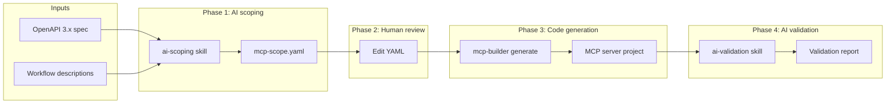

# mcp-builder

A pipeline for generating ToolHive-ready MCP servers from OpenAPI specs.

## Why it exists

Wrapping an OpenAPI spec as an MCP server one-for-one doesn't work: enterprise
APIs expose hundreds of endpoints, auto-generated names like
`drives_files_list_v2` tell an LLM nothing, and parameter docs are written for
developers instead of models. `mcp-builder` curates the spec into a short YAML
contract (`mcp-scope.yaml`), then deterministically generates a complete
ToolHive-ready server from that contract. AI assists at the edges (scoping and
validation); the code generator itself is plain Python with no model in the
loop. See the [RFC](docs/rfc-custom-mcp-server-builder.md) for the full design.

## Quick start

### Install the CLI

Requires Python 3.13+ and [uv](https://docs.astral.sh/uv/).

```bash
git clone https://github.com/StacklokLabs/mcp-builder.git
cd mcp-builder
uv sync
```

Run `uv run mcp-builder --help` to see the full list of CLI commands.

### Install the AI skills and agents

Phases 1 and 4 (and the optional deploy step) are driven by AI skills that
live in `skills/`. The skills spawn sub-agents from `agents/` (for spec
analysis, tool scoping, validation, and polish). Both need to be visible to
your AI coding tool. Symlinking from the repo keeps them in sync with
`git pull`.

**Claude Code** — symlink the skills into `~/.claude/skills/` and the agents
into `~/.claude/agents/` (user-level, available everywhere). Swap `~/.claude/`
for a project-level `.claude/` to install locally instead.

```bash
# Skills
ln -s "$PWD/skills/ai-scoping"    ~/.claude/skills/ai-scoping
ln -s "$PWD/skills/ai-validation" ~/.claude/skills/ai-validation
ln -s "$PWD/skills/deploy-assist" ~/.claude/skills/deploy-assist

# Agents
ln -s "$PWD/agents/spec-analyzer.md"    ~/.claude/agents/spec-analyzer.md
ln -s "$PWD/agents/endpoint-scoper.md"  ~/.claude/agents/endpoint-scoper.md
ln -s "$PWD/agents/code-validator.md"   ~/.claude/agents/code-validator.md
ln -s "$PWD/agents/polish-suggester.md" ~/.claude/agents/polish-suggester.md
```

Once installed, the skills appear as slash commands: `/ai-scoping`,
`/ai-validation`, `/deploy-assist`.

**Gemini CLI** — Gemini CLI supports skills at `~/.gemini/skills/` and
sub-agents at `~/.gemini/agents/` (swap for workspace-level `.gemini/...` if
you prefer). The install is symmetric with Claude Code:

```bash
# Skills
ln -s "$PWD/skills/ai-scoping"    ~/.gemini/skills/ai-scoping
ln -s "$PWD/skills/ai-validation" ~/.gemini/skills/ai-validation
ln -s "$PWD/skills/deploy-assist" ~/.gemini/skills/deploy-assist

# Agents
ln -s "$PWD/agents/spec-analyzer.md"    ~/.gemini/agents/spec-analyzer.md
ln -s "$PWD/agents/endpoint-scoper.md"  ~/.gemini/agents/endpoint-scoper.md
ln -s "$PWD/agents/code-validator.md"   ~/.gemini/agents/code-validator.md
ln -s "$PWD/agents/polish-suggester.md" ~/.gemini/agents/polish-suggester.md
```

Gemini CLI also ships `gemini skills link <path>`, which auto-discovers and
symlinks SKILL.md files if you'd rather not do it by hand.

### Run the pipeline

The pipeline has four phases. Phases 1 and 4 run inside your AI coding tool
via the skills above. Phases 2 and 3 are CLI steps you run at the terminal.

**Phase 1 — Scope the API.** Launch your AI coding tool (Claude Code or
Gemini CLI) and type `/ai-scoping <path-to-openapi-spec>`. The skill walks
you through spec analysis, semantic endpoint grouping, tool naming,
LLM-optimized description writing, and auth detection, pausing at review
gates along the way. Output: a curated `mcp-scope.yaml` plus a
`scoping-summary.md` explaining the AI's choices.

**Phase 2 — Human review.** Open `mcp-scope.yaml` and the accompanying
`scoping-summary.md` the skill produced. Review the AI's group and tool
choices, tweak descriptions, fix anything that's wrong, and sanity-check the
detected auth. The scoping skill already runs `mcp-builder validate` against
the spec before handing off, so no separate validation step is needed — but
if you make substantial edits, re-running `validate` is a quick safety net.

**Phase 3 — Generate the server.** You need a local checkout of
[`mcp-template-py`](https://github.com/StacklokLabs/mcp-template-py) first
(one-time setup — clone it anywhere on disk):

```bash
git clone https://github.com/StacklokLabs/mcp-template-py.git ../mcp-template-py
```

Then run:

```bash
uv run mcp-builder generate path/to/mcp-scope.yaml path/to/openapi.yaml ../mcp-template-py --output-dir ./out
```

This is fully deterministic — no AI in the loop — and produces a complete
MCP server project plus ToolHive deployment manifests in `./out`.

**Phase 4 — Validate and polish.** Launch your AI coding tool and type
`/ai-validation <generated-project-dir> <scope-yaml> <spec-path>`. The skill
verifies structural and behavioral correctness (every scoped tool is
present, HTTP methods match the spec, auth is wired correctly), builds the
Docker image, and suggests improvements driven by the hints in the scope
(response shaping for large payloads, pagination helpers, API quirks). Tip:
before moving on, run the built image locally (`docker run` with real
credentials) and hit `/mcp` once — structural validation catches shape
bugs, but not runtime behavior.

**Optional — Deploy.** Before deploying you need the container image in a
registry your cluster can reach. Phase 4 builds the image locally; tag and
push it to your registry of choice ([ttl.sh](https://ttl.sh) works without
auth for quick iteration). Then launch your AI coding tool and type
`/deploy-assist <generated-project-dir> <cluster-repo-path>`. The skill
drops the generated manifests into your cluster repo, fills placeholders by
inferring values from existing cluster configuration, and lists the manual
steps that remain (for example, creating the K8s Secret with real
credentials).

Example OpenAPI specs you can run the pipeline against live in
`e2e/fixtures/` (Google Drive, GitHub, Jira, BambooHR, Stripe, Slack, and
more).

## Limitations

Scope of the current version:

- **OpenAPI 3.0 / 3.1 only.** No Swagger 2.0, GraphQL, gRPC, or WSDL.
- **1:1 endpoint-to-tool mapping.** Merging related endpoints into a single
  tool is deferred.
- **Single spec per server.** No multi-spec composition or vMCP groups.
- **SDK-only APIs are not supported** (e.g., Google services with no usable
  spec).
- **ToolHive-supported auth only**: OAuth2 authorization code, HTTP bearer,
  and header-injected API keys. Query-parameter API keys and HTTP basic are
  flagged but not generated.
- **Python output only.** The generator targets
  [`mcp-template-py`](https://github.com/StacklokLabs/mcp-template-py); other
  language templates are future work.
- **No spec-diffing.** Detecting upstream API changes and re-running the
  pipeline is a manual step.

## How it works



Phase 3 is intentionally deterministic: the same `mcp-scope.yaml` and spec
always produce the same server, which makes the output reviewable and
reproducible in CI. Phase 4 is where AI re-enters — to catch generator bugs
and suggest improvements the generator can't anticipate (pagination, response
shaping, API quirks). A user who prefers no AI can hand-write the YAML and
enter at Phase 3. Full rationale, alternatives, and the `mcp-scope.yaml`
schema live in the [RFC](docs/rfc-custom-mcp-server-builder.md).

## Development

Task runners are defined in `Taskfile.yml`:

```bash
task check       # lint + typecheck + test + security
task test        # unit tests
task test-e2e    # end-to-end tests (generates servers from fixtures)
task format      # ruff format + fix
```

The repo uses `uv` for dependency management, `ruff` for lint/format, `ty` for
typechecking, and `pytest` for tests. See [`CLAUDE.md`](CLAUDE.md) for
project-specific implementation guidelines.

## Related

- [RFC: Custom MCP Server Builder](docs/rfc-custom-mcp-server-builder.md) — full design and alternatives considered
- [`mcp-template-py`](https://github.com/StacklokLabs/mcp-template-py) — Python MCP server template the generator builds from
- [ToolHive](https://github.com/stacklok/toolhive) — runtime for MCP servers
