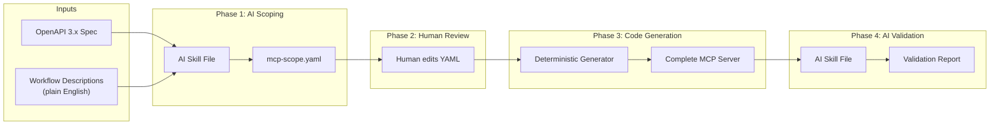

# RFC: Custom MCP Server Builder

- **Status**: Draft
- **Author(s)**: Laurel Orr (@lorr1)
- **Created**: 2026-04-07
- **Last Updated**: 2026-04-07
- **Target Repository**: mcp-builder
- **Related Issues**: https://github.com/stacklok/ai-toolkit/issues/111

## Summary

A repeatable, four-phase pipeline that transforms an OpenAPI spec and plain-English workflow descriptions into a production-quality, ToolHive-ready MCP server. Phase 1 (AI Scoping) uses AI skill files to parse the spec, semantically group endpoints, assign LLM-optimized tool names and descriptions, and emit a single `mcp-scope.yaml` config. Phase 2 (Human Review) is an edit pass over that YAML. Phase 3 (Deterministic Code Generation) reads the YAML and scaffolds a complete MCP server from the `mcp-template-py` — no AI involved. Phase 4 (AI Validation and Polish) reviews the generated code for correctness, makes corrections or improvements guided by hints in the config, and verifies the build succeeds. The first proof point is a Google Drive MCP server deployed in North's cluster.

## Problem Statement

### Wrapping an OpenAPI Spec Doesn't Work Out of the Box

A typical enterprise API spec (Jira, HubSpot, AWS) exposes 200–500+ endpoints. Naively wrapping the entire spec as MCP tools creates cascading problems:

- **Tool selection accuracy degrades**: LLM tool-calling accuracy drops sharply beyond ~30 tools. Exposing hundreds is a non-starter.
- **Auto-generated names are meaningless**: OpenAPI `operationId` values like `drives_files_list_v2` tell an LLM nothing about intent.
- **Descriptions are written for developers, not AI**: Parameter descriptions assume the reader knows the API. LLMs need descriptions that encode behavior, constraints, and defaults.
- **No workflow context**: Without knowing *what the user is trying to do*, there's no principled way to select which subset of endpoints to expose.

Open-source proxies like [mcp-openapi-proxy](https://github.com/rendis/mcp-openapi-proxy) prove the concept but are not production quality — they pass through the full spec surface, offer no curation, and generate no ToolHive deployment artifacts.

### Who Is Affected

- **North's platform team**: They need custom MCP servers for internal services (Google Drive, BambooHR, Harvest, Greenhouse) and lack the tooling to build them repeatably. They also haven't decided which specific MCP server to build first — which makes delivering the *pipeline* more valuable than delivering any single server.
- **ToolHive team (us)**: We need to build MCP servers for the ToolHive ecosystem — both for demos and for real deployments. The builder is our own tool for scaling MCP server production.
- **Future ToolHive customers**: The same problem exists for every enterprise API without a first-party MCP server. The builder makes this a commodity operation rather than bespoke engineering.

### Why Worth Solving

North's POC deliverable includes both a working MCP server *and* the ability to independently repeat the process. A one-off server build doesn't compound. By delivering the builder instead of just a server, North can build the MCP server for whichever service they decide on. This also establishes the pattern for future ToolHive ecosystem growth: as customers adopt ToolHive, they will need to wrap internal APIs that will never have community MCP servers.

Critically, early customers are new to AI tooling. A pipeline that is all-AI — slow, non-deterministic, and unfamiliar — is harder to trust and maintain than one with a deterministic core that teams can reason about. AI should enhance the edges, not own the foundation. We can add more (or less) AI over time as we grow and evolve the builder.

## Goals

- Define the `mcp-scope.yaml` contract that bridges AI-assisted scoping and deterministic code generation, in enough detail that either side can be built independently.
- Specify the AI skill file behavior for Phase 1 (scoping) and Phase 4 (validation) — inputs, outputs, decision logic, and failure modes.
- Specify the deterministic code generator for Phase 3 — what it reads, what it produces, and the guarantees it provides.
- Produce a pipeline that works for any OpenAPI 3.x spec with ToolHive-supported auth patterns.
- Deliver a working Google Drive MCP server as the first proof point.

## Non-Goals

- **Tool consolidation (merging endpoints)**: Each endpoint maps 1:1 to a tool in v1. Merging related endpoints (e.g., `list_files` + `get_file` into a single tool with optional ID parameter) is deferred to v2, depending on how v1 performs in practice.
- **Spec diffing / upstream change detection**: When the upstream API publishes a new spec version, detecting what changed and re-running the pipeline is a manual process for now.
- **Multi-spec composition**: Combining multiple OpenAPI specs into a single MCP server (or vMCP group) is out of scope.
- **Runtime proxy**: This pipeline generates static, compiled MCP servers — not a runtime proxy that interprets the spec at request time. See [Alternatives Considered](#alternatives-considered) for why.
- **Non-OpenAPI specs**: GraphQL, gRPC, or WSDL inputs are not supported.
- **SDK-only APIs**: Some services (e.g., parts of Google's API surface) only offer SDKs with no usable OpenAPI spec. Supporting SDK-based generation is a future extension — the `mcp-scope.yaml` format could drive it, but the generator would need a different code path.
- **vMCP optimizer tuning**: The vMCP optimizer and description overrides exist as a post-deploy safety net. This RFC focuses on generating clean servers that minimize the need for post-deploy tuning.

## Proposed Solution

### High-Level Design



Phase 3 (code generation) is intentionally deterministic. This is a deliberate design choice: the first pass of server construction is a pure function of the config, which makes it reproducible, testable, and trustworthy. AI re-enters in Phase 4 to catch generator bugs and polish the output, but the structural foundation is always deterministic. See [Alternatives Considered](#alternatives-considered) for why we don't use AI for code generation itself. A user who wants to skip AI entirely can hand-write the YAML and enter at Phase 3.

### Detailed Design

---

#### Phase 1: AI Scoping

**Purpose**: Transform an OpenAPI spec + workflow descriptions into a curated, LLM-optimized `mcp-scope.yaml`.

**Executor**: AI skill file (reusable instruction set for Claude Code, Gemini, or any AI coding assistant).

**Inputs**:

| Input | Required | Description |
|-------|----------|-------------|
| OpenAPI spec | Yes | OpenAPI 3.0 or 3.1 spec (JSON or YAML). Can be a URL or local file path. |
| Workflow descriptions | Yes | One or more plain-English descriptions of what users need to accomplish. Multiple workflows capture breadth across teams/personas. |
| Auth hint | No | If the spec's `securitySchemes` are ambiguous or missing, the user can provide an explicit auth pattern (e.g., "OAuth2 with Google OIDC"). |

**Process**:

The skill file guides the AI through the following steps. Each step produces intermediate output that the user can inspect before proceeding.

1. **Spec Parsing and Quality Assessment**
   - Parse the OpenAPI spec and extract all endpoints, parameters, request/response schemas, and security schemes.
   - Produce a quality report: count of endpoints, percentage with descriptions, parameter documentation coverage, schema completeness.
   - Flag spec quality issues that will require human attention (e.g., missing descriptions on >50% of parameters, inconsistent naming, undocumented auth flows).

2. **Semantic Endpoint Grouping**
   - Cluster all endpoints into meaningful semantic groups based on the API's domain (e.g., "File Operations", "Permissions", "Comments", "Revisions"). This is similar to how [GitHub's remote MCP server](https://api.githubcopilot.com/mcp/) organizes endpoints into toolsets — users can include or exclude entire groups rather than picking endpoints one by one.
   - Workflow descriptions inform which groups are likely relevant, but the grouping itself is by API domain, not by workflow. An endpoint doesn't need to match a workflow to be included in a group.
   - Each endpoint belongs to at most one group.
   - Present the groups to the user for approval before proceeding.

3. **Tool Naming**
   - Evaluate each endpoint's existing `operationId` and summary. If the name is already clean and LLM-friendly, keep it. Only rename when the existing name is unclear, too long, or follows a convention that doesn't help tool selection (e.g., `drives_files_list_v2` → `list_files`).
   - Names follow the pattern `verb_noun` (e.g., `list_files`, `create_document`, `search_contacts`).
   - 1:1 mapping: each endpoint gets exactly one tool name. No merging in v1.
   - Names must be unique within the server, concise (≤40 characters), and use snake_case.

4. **Description and Hint Writing**
   - Evaluate each tool's existing description from the spec. If it's already clear, accurate, and useful for an LLM, keep it as-is. Only rewrite descriptions that are missing, developer-oriented ("Returns a 200 OK"), or too terse to convey intent.
   - For tools that need new descriptions: write LLM-optimized descriptions that encode what the tool does, when to use it, what it returns, and any non-obvious constraints.
   - Same principle for parameter descriptions — override only when the spec's description is missing or unhelpful. Include default values, valid ranges, enum values, and behavioral notes that the spec's description may omit.
   - For specs with poor documentation: the AI infers behavior from the endpoint path, HTTP method, parameter names, and schema structure. These inferred descriptions are flagged for human review.
   - Add `hints` to tools where the AI notices issues the deterministic generator won't handle: pagination patterns, large response payloads, known API quirks, rate limit concerns, or opportunities for response shaping. These hints flow through to Phase 4.

5. **Auth Detection**
   - Read the spec's `securitySchemes` and map them to ToolHive auth patterns:

     | OpenAPI Security Scheme | ToolHive Pattern | Config Type |
     |------------------------|------------------|-------------|
     | `oauth2` (authorization code) | `embeddedAuthServer` | `MCPExternalAuthConfig` with OIDC upstream |
     | `http` (bearer) | `bearerToken` | K8s Secret reference |
     | `apiKey` (header) | `headerInjection` | K8s Secret reference |
     | `apiKey` (query) | **Not supported** | Flagged for human attention |
     | `http` (basic) | **Not supported** | Flagged for human attention |

   - If the spec declares multiple security schemes, the AI selects the one most compatible with ToolHive and notes alternatives.

6. **Output Generation**
   - Produce the final `mcp-scope.yaml` file. See the Intermediate Artifact section below for the full schema.

**Failure Modes**:

| Failure | Behavior |
|---------|----------|
| Spec is invalid or unparseable | Skill exits with error and spec quality report |
| Spec is too large to process | Some enterprise specs (500+ endpoints, 50k+ lines) exceed AI context limits. The skill chunks the spec by tag/path prefix and processes groups independently, or asks the user to pre-filter. |
| Auth scheme is unsupported | Skill flags in quality report; user must provide workaround or skip auth |
| Spec has no descriptions | Skill infers all descriptions and flags 100% for human review |

---

#### Intermediate Artifact: `mcp-scope.yaml`

This is the contract between the AI/human world (Phases 1–2) and the deterministic world (Phase 3). The generator only needs this file. Someone can write it entirely by hand to skip all AI steps.

```yaml
# mcp-scope.yaml — complete example for Google Drive
version: "1"

server:
  name: google-drive
  description: "Google Drive MCP server for file and document management"

spec:
  source: "https://www.googleapis.com/discovery/v1/apis/drive/v3/rest"
  format: openapi3  # openapi3 | openapi3.1
  total_endpoints: 38
  scoped_endpoints: 6

workflows:
  - "Engineers search for, read, and organize design docs and specs"
  - "Team leads share folders with external collaborators and manage permissions"

groups:
  - name: file-operations
    description: "Core file CRUD and search"
    tools:
      - tool_name: list_files
        endpoint: GET /drive/v3/files
        description: >
          List files in the user's Drive or a specific folder. Returns file
          names, IDs, MIME types, and modification times. Use this to browse
          or search for files. Supports query filtering via the 'q' parameter
          using Drive query syntax.
        parameters:
          - name: q
            description: >
              Drive search query string. Examples: "name contains 'design'"
              or "mimeType = 'application/pdf'". See Drive query syntax docs.
            required: false
          - name: pageSize
            description: >
              Number of files to return per page. Default is 100. Maximum is 1000.
            required: false
          - name: fields
            description: >
              Comma-separated list of file fields to include in the response.
              Default returns a minimal set. Use "files(id,name,mimeType,modifiedTime)"
              for common fields.
            required: false
        hints:
          - "paginated: uses pageToken/nextPageToken cursor pattern"
          - "response is large — consider extracting only id, name, mimeType, modifiedTime"

      - tool_name: get_file
        endpoint: GET /drive/v3/files/{fileId}
        description: >
          Get metadata for a single file by ID. Returns the full file resource
          including name, size, MIME type, permissions, and parent folders.
        parameters:
          - name: fileId
            description: "The ID of the file to retrieve."
            required: true
        hints:
          - "response has 50+ fields — consider response shaping"

      # ... additional tools ...

  - name: permissions
    description: "Sharing and access control"
    tools:
      - tool_name: list_permissions
        endpoint: GET /drive/v3/files/{fileId}/permissions
        description: >
          List all permissions on a file or folder. Returns who has access
          and their role (reader, writer, owner).
        parameters:
          - name: fileId
            description: "The ID of the file or folder."
            required: true

      # ... additional tools ...

auth:
  pattern: embeddedAuthServer
  upstream:
    type: oidc
    issuer: "https://accounts.google.com"
    scopes:
      - openid
      - email
      - https://www.googleapis.com/auth/drive.readonly
  notes: >
    Google Drive uses OAuth2 with OIDC. Toolhive's embedded auth server
    handles the flow. The MCP server enables allow_token_passthrough and
    forwards the Bearer token to Drive API endpoints.
```

**Schema Rules**:

- `version`: Always `"1"`. Reserved for future schema evolution.
- `server.name`: Used as the Docker image name, ToolHive registry entry key, and Python package name. Must be a valid DNS label (`[a-z0-9-]+`).
- `spec.source`: URL or relative file path to the OpenAPI spec.
- `spec.total_endpoints` / `spec.scoped_endpoints`: Informational counts for human context. The generator ignores them.
- `groups`: At least one required. If grouping doesn't matter, put everything in one group.
- `groups[].tools[].endpoint`: Must match an endpoint in the spec exactly (`METHOD /path`).
- `groups[].tools[].tool_name`: Unique within the server. Snake_case, ≤40 chars.
- `workflows`: Optional list of plain-English workflow descriptions. Used by Phase 1 AI to drive endpoint clustering. Preserved in the YAML as documentation for anyone reading the config later.
- `auth.pattern`: Must be one of: `embeddedAuthServer`, `bearerToken`, `headerInjection`, `upstreamInject`, `none`.
- `hints`: Optional list of free-text strings per tool. The generator ignores them — they pass through to Phase 4 as instructions to the AI polish step. Use hints to flag known issues the generator can't handle: pagination quirks, large responses that need shaping, required-but-not-marked-required params, rate limit concerns, multi-call opportunities, or anything else that needs human or AI attention after code generation.
- Any tools not in the YAML are ignored.
- In contrast, any parameters not in the YAML are pulled from the spec and used as-is. The YAML provides overrides for parameters.

---

#### Phase 2: Human Review

**Purpose**: Quality gate between AI-assisted scoping and deterministic code generation.

**Executor**: Human (the developer or platform engineer).

**What gets reviewed**:

| Section | Review Focus |
|---------|-------------|
| `groups` and `tools` | Are the right endpoints selected? Are any missing? Are any unnecessary? |
| `tool_name` values | Are names clear and consistent? Will an LLM understand the intent from the name alone? |
| Tool descriptions | Do they accurately describe behavior? Are constraints and defaults correct? |
| Parameter descriptions | Are inferred descriptions accurate? |
| `auth` | Is the detected pattern correct? Are scopes complete? |

**What the human provides at this stage**:

- Auth credentials for deployment (client ID, client secret, API keys). These are stored as K8s Secrets — they do not go in the YAML.
- Any manual overrides to tool names, descriptions, or endpoint selection.

**Output**: An edited `mcp-scope.yaml` ready for code generation.

---

#### Phase 3: Deterministic Code Generation

**Purpose**: Read `mcp-scope.yaml` and produce a complete, deployable MCP server. No AI. Fully reproducible — same input always produces the same output.

**Executor**: A lightweight Python script in this repo (`mcp-builder/generator/`). This is not a template engine or compiler — the generated tool functions are uniform enough that a ~200-line script can produce them via straightforward string construction. Heavy lifting for Pydantic models is delegated to `datamodel-code-generator` (a battle-tested library that reads OpenAPI schemas).

If there is brittleness in this approach, the AI review in phase 4 can help recover.

**Inputs**:

| Input | Description |
|-------|-------------|
| `mcp-scope.yaml` | The reviewed config from Phase 2 |
| `py-mcp-template` | The base Python MCP server template (separate repo) |
| OpenAPI spec | The original spec (referenced by `spec.source` in the YAML), used to extract request/response schemas |

**What gets generated**:

```
google-drive-mcp/
├── pyproject.toml              # From template, updated: name, description, dependencies
├── Dockerfile                  # From template, unchanged
├── Taskfile.yml                # From template, unchanged
├── src/
│   └── google_drive_mcp/
│       ├── __init__.py         # From template, renamed module
│       ├── __main__.py         # From template, unchanged
│       ├── settings.py         # From template, updated: add API-specific settings (base URL)
│       ├── configure_logging.py # From template, unchanged
│       ├── api/
│       │   ├── app_builder.py  # From template, updated: wire new tools + client
│       │   ├── mcp_builder.py  # From template, updated: register generated tools
│       │   ├── models.py       # GENERATED: Pydantic request/response models per tool
│       │   └── tools.py        # GENERATED: tool functions, one per endpoint
│       ├── client.py           # GENERATED: async HTTP client with token passthrough
│       └── auth/               # From template, unchanged (auth middleware, token store)
└── deploy/
    ├── mcpserver.yaml          # GENERATED: ToolHive MCPServer CRD manifest
    ├── mcpexternalauthconfig.yaml  # GENERATED: auth config (if applicable)
    └── secret.yaml             # GENERATED: K8s Secret template (placeholder values only)
```

Most of the project comes from `mcp-template-py` unchanged — the auth middleware, OAuth router, logging, Dockerfile, Taskfile, and test scaffolding are all inherited. The generator only produces 3–4 new files (models, tools, client, deploy manifests) and updates a few existing ones (pyproject.toml, settings, mcp_builder).

**Generation rules**:

1. **Project scaffolding**: Copy `py-mcp-template` as the base. Set `server.name` in `pyproject.toml`, `Dockerfile` labels, and module names.

2. **Pydantic models** (`models/schemas.py`):
   - For each tool's endpoint, extract the request body schema and response schema from the OpenAPI spec.
   - Generate Pydantic v2 models with `Field()` descriptions pulled from the YAML's parameter descriptions (which override the spec's).
   - Path parameters, query parameters, and request body fields each produce model fields.

3. **Tool modules** (`tools/<group_name>.py`):
   - One Python module per group in the YAML.
   - Each tool is an `async def` function decorated with the MCP tool decorator.
   - The function signature uses the generated Pydantic model as input.
   - The function body calls the HTTP client with the correct method, path, query params, and request body.
   - Tool name and description come directly from the YAML.

4. **HTTP client** (`client.py`):
   - Async HTTP client (httpx-based) with `allow_token_passthrough: true`.
   - Reads the `Authorization` header from the incoming MCP request context and forwards it to the upstream API.
   - Base URL derived from the OpenAPI spec's `servers[0].url`.
   - No retry logic, no caching — keep it simple for v1.

5. **Server entrypoint** (`server.py`):
   - Registers all tools from all group modules.
   - Configures structured logging (JSON format).
   - Exposes the MCP server on the standard stdio transport (ToolHive handles HTTP/SSE transport externally).

6. **ToolHive deployment manifests** (`deploy/`):
   - `mcpserver.yaml`: ToolHive `MCPServer` CRD manifest with the Docker image reference, resource limits, and auth config reference.
   - `mcpexternalauthconfig.yaml`: If `auth.pattern` is `embeddedAuthServer`, generates the `MCPExternalAuthConfig` CRD with the upstream IDP config from the YAML.
   - `secret.yaml`: Template with placeholder values for credentials. Never contains actual secrets.

**Auth wiring**:

The generated MCP server has **zero OAuth logic**. Auth is entirely ToolHive's responsibility. The server's only auth-related behavior:

- Enables `allow_token_passthrough: true` in its ToolHive config.
- Reads the `Authorization` header from the request context.
- Forwards it as `Authorization: Bearer <token>` to the upstream API.

This means the generator only needs to know the auth pattern (to produce the correct ToolHive CRD manifests), not the auth implementation.

---

#### Phase 4: AI Validation and Polish

**Purpose**: Two jobs. First, catch bugs in the generated code (adversarial review). Second, suggest improvements that the deterministic generator can't anticipate — API-specific error handling, response shaping for large payloads, pagination helpers, or quirks in the upstream API that the spec doesn't document. The first job is verification; the second is polish. Both produce suggestions for the developer to accept or reject.

**Executor**: AI skill file (same tooling as Phase 1, different skill).

**Inputs**:

| Input | Description |
|-------|-------------|
| Generated server code | The complete output of Phase 3 |
| `mcp-scope.yaml` | The config that drove generation |
| OpenAPI spec | The original spec, for cross-referencing |

**Validation checks**:

1. **Structural correctness**
   - Every tool in the YAML has a corresponding function in the generated code.
   - Every Pydantic model field matches a parameter in the YAML.
   - Import paths resolve. No circular imports.

2. **Behavioral correctness**
   - HTTP methods match the spec (GET endpoints don't generate POST calls).
   - Path parameters are correctly interpolated into URLs.
   - Required parameters are enforced; optional parameters have defaults.
   - Response parsing matches the spec's response schema.

3. **Auth wiring**
   - Token passthrough is enabled.
   - The `Authorization` header is forwarded on every API call.
   - No hardcoded credentials in the generated code.

4. **ToolHive integration**
   - CRD manifests are valid YAML and reference the correct image.
   - Auth config CRD matches the YAML's `auth` section.
   - Secret template has all required keys.

5. **Build verification**
   - Build the Docker image and verify it succeeds.
   - Smoke testing against the real API is the developer's responsibility — Phase 4 does not run live API calls.

**Polish suggestions** (developer accepts or rejects):

The AI polish step draws from two sources: its own analysis of the generated code against the spec, and the `hints` attached to each tool in `mcp-scope.yaml`. Hints are the mechanism for Phase 1 (AI scoping) or Phase 2 (human review) to communicate known issues forward to Phase 4. For example, if Phase 1 detects that an endpoint uses cursor-based pagination, it adds a hint like `"paginated: uses pageToken/nextPageToken cursor pattern"`. The generator ignores this and produces a naive one-page implementation. Phase 4 reads the hint and suggests adding pagination support to the generated code.

Categories of polish suggestions:

- **Response shaping** (often hint-driven): If an endpoint returns a large payload (50+ fields), suggest extracting the most useful fields into a summary response so the LLM doesn't burn context on noise.
- **Error normalization**: If the upstream API returns non-standard errors, suggest adding a try/except that maps them to clear MCP error responses.
- **Pagination** (often hint-driven): If a list endpoint supports cursor/offset pagination, suggest adding a `page_token` parameter and wiring it through correctly for the specific API's pagination pattern.
- **API quirks** (often hint-driven): If the spec omits known behavioral quirks (rate limits, required-but-not-marked-required params, content-type gotchas), flag them with suggested workarounds.
- **Generator bugs**: If the deterministic generator produced incorrect code (wrong URL construction, missing param, bad type mapping), the AI catches it here. This makes the overall pipeline robust to imperfections in the generator — Phase 4 is a safety net, not just a nice-to-have.

**Output**: A validation report listing pass/fail for each structural check, plus a separate list of polish suggestions with diffs. The developer reviews both. Validation failures block deployment; polish suggestions are optional.

**Failure modes**:

| Failure | Severity | Action |
|---------|----------|--------|
| Missing tool in generated code | Error | Block deployment. Likely a generator bug. |
| Wrong HTTP method | Error | Block deployment. Generator bug. |
| Auth header not forwarded | Error | Block deployment. |
| Build fails | Error | Block deployment. Dependency or template issue. |
| Description mismatch with spec | Info | Cosmetic. Human decides. |
| Polish suggestion | Info | Developer accepts or rejects. Does not block. |

---

## Security Considerations

### Threat Model

The primary threat surface is the generated MCP server running in a customer's cluster with access to upstream APIs.

- **Malicious spec injection**: A crafted OpenAPI spec could produce generated code with injection vulnerabilities (e.g., unsanitized path parameters leading to SSRF). Mitigation: the generator uses parameterized URL construction (never string concatenation for paths), and Phase 4 validates all URL construction.
- **Credential exposure**: Auth credentials must never appear in generated code, YAML configs committed to git, or Docker image layers. Mitigation: credentials are stored exclusively in K8s Secrets; the generator produces only template references.
- **Overprivileged scope**: The AI in Phase 1 might select OAuth scopes broader than necessary. Mitigation: scopes are visible in `mcp-scope.yaml` and subject to human review in Phase 2.

### Authentication and Authorization

The generated MCP server performs no authentication. All auth is delegated to ToolHive via the patterns documented in the `auth` section of `mcp-scope.yaml`. The server only forwards tokens — it never validates, stores, or logs them.

### Secrets Management

- OAuth client IDs and secrets: stored in K8s Secrets, referenced by `MCPExternalAuthConfig` CRD.
- API keys: stored in K8s Secrets, injected via ToolHive's `headerInjection` pattern.
- The `secret.yaml` template in `deploy/` contains placeholder values only. Actual secret creation is a manual step (or handled by the customer's secrets management pipeline).

### Input Validation

- The generator validates `mcp-scope.yaml` against the schema before generating code.
- Generated Pydantic models enforce type constraints on tool inputs.
- Path parameters are validated as non-empty strings before URL interpolation.

## Alternatives Considered

We evaluated three approaches for how to go from `mcp-scope.yaml` to a running MCP server. Each represents a different point on the automation-vs-control spectrum.

### Alternative A: Fully AI-Generated Servers

An AI skill file reads `mcp-scope.yaml`, reads the `mcp-template-py` repo as a reference implementation, and generates the entire server. No deterministic code generation step — the AI writes all the code, and a separate AI validation pass catches errors.

- **Pros**: Minimal upfront engineering. Handles edge cases in specs naturally. Flexible — the AI can adapt to unusual API patterns without explicit handling in a generator. Skill files are easy to iterate on.
- **Cons**: Non-reproducible — two runs produce different code. The entire server is AI-written, making the audit surface large and hard to trust. No clear structural guarantees (correct auth wiring, valid CRDs, no missing tools). Early customers are likely to be skeptical of an all-AI pipeline — "the AI wrote the AI's instructions to write the code" is a hard pitch for engineering teams evaluating whether to adopt this.
- **Why not chosen**: Customers need to trust the output. A fully AI-generated server puts the burden of verification entirely on the human reviewer, who now has to audit hundreds of lines of generated code instead of a concise config. The lack of reproducibility also makes CI/CD integration difficult.

### Alternative B: Runtime OpenAPI Proxy

Instead of generating server code, ship a single generic proxy binary (like [yas-mcp](https://github.com/allen-munsch/yas-mcp), [mcp-openapi-proxy](https://github.com/rendis/mcp-openapi-proxy), or [AWS openapi-mcp-server](https://awslabs.github.io/mcp/servers/openapi-mcp-server)) that reads `mcp-scope.yaml` at startup and proxies MCP tool calls to the upstream API at runtime. One Docker image serves every API — only the config changes.

- **Pros**: Zero build step. Change the YAML, restart the pod. One image to secure, patch, and scan. Fastest possible iteration loop. Several open-source implementations already exist (yas-mcp in Rust, mcp-openapi-proxy in Go, openapi-mcp-generator in TypeScript).
- **Cons**: Each tool is exactly one HTTP call — no multi-call tools, no response transformation, no custom logic. Real-world APIs are messy: pagination varies wildly across services, error responses need normalization, some endpoints return 500-field JSON blobs where you only want 5 fields, and many APIs have quirks that require massaging requests or responses. Handling all of this in the proxy means pushing complexity into the config format — pagination strategies, response field filters, request transformations — until the YAML becomes its own DSL that's harder to maintain than actual code. And when there's no OpenAPI spec at all (SDK-only APIs like some Google services), the proxy has nothing to parse.
- **Why not chosen**: The proxy ceiling is too low for production use. The moment a customer needs to combine two API calls into one tool, shape a response, handle service-specific pagination, or work with an SDK-only API, they're stuck. You'd end up building a programming language inside YAML to handle the edge cases that real APIs demand.

### Chosen Approach (C): Config-Driven Code Generation with AI Polish

A lightweight Python script reads `mcp-scope.yaml` and the OpenAPI spec, then deterministically generates a complete MCP server from the `mcp-template-py` base. The generated code is simple and uniform — each tool is a short function that makes one HTTP call via an async client with token passthrough. After generation, an AI validation pass reviews the code for correctness, builds the Docker image, and smoke-tests against the real API. The AI can also suggest improvements to the generated code (better error handling for specific API quirks, response shaping, etc.) which the developer accepts or rejects.

This is the approach described in Phases 3 and 4 of this RFC.

- **Pros**: Reproducible — same config always produces the same base code. The generated code is real Python that developers can read, modify, and extend. Customers can add custom logic for multi-call tools, response shaping, or SDK integration after generation. The AI polish step catches generator bugs and handles the long tail of API quirks without baking that complexity into the generator itself. Sets up well for CI/CD: config change → re-run script → AI review → push image.
- **Cons**: There is a maintenance surface — each generated server is its own repo/image. At scale (100+ MCP servers), keeping generated servers up to date with template changes or upstream spec changes requires tooling (spec diffing, bulk regeneration) that doesn't exist yet. This is acceptable for now but will need investment if the pattern scales.
- **Why chosen**: Balances the two extremes. The deterministic generator provides the structural trust that early customers need ("I can read the code, I can see what it does"). The AI polish handles the messy reality that no generator can anticipate every API quirk. And because the output is real code, not a black-box proxy, customers can always drop down and customize when the generated version isn't enough.

**Prior art**: The [openapi-mcp-generator](https://github.com/harsha-iiiv/openapi-mcp-generator) (TypeScript) takes a similar codegen approach — CLI reads spec, outputs a complete project — but without the config-driven curation step or AI-assisted description writing that makes generated tools useful to LLMs. Christian Posta's [analysis](https://blog.christianposta.com/semantics-matter-exposing-openapi-as-mcp-tools/) argues that semantic enrichment (better names, descriptions, usage context) is the key gap — which is exactly what our Phase 1 AI scoping and `mcp-scope.yaml` address.

## Compatibility

### Backward Compatibility

N/A — this is a new system with no prior version.

### Forward Compatibility

- **`mcp-scope.yaml` versioning**: The `version: "1"` field allows future schema evolution. The generator checks the version and rejects unknown versions with a clear error.
- **Tool consolidation (v2)**: The YAML schema can be extended to support many-to-one endpoint-to-tool mappings without breaking existing 1:1 configs.
- **Additional languages**: The generator currently targets Python via `py-mcp-template`. Additional language templates (TypeScript, Go) can be added as separate template repos with their own generators, all reading the same `mcp-scope.yaml`.
- **Spec diffing**: A future tool can diff two versions of `mcp-scope.yaml` (generated from old and new specs) to surface what changed.

## Implementation Plan

### Phase A: Foundation

- Define and validate the `mcp-scope.yaml` JSON schema.
- Build the deterministic code generator (Phase 3) against the schema using `py-mcp-template`.
- Write a sample `mcp-scope.yaml` for Google Drive by hand to bootstrap testing.
- Verify the generator produces a working server from the hand-written YAML.

### Phase B: AI Skills

- Write the Phase 1 (scoping) skill file.
- Write the Phase 4 (validation) skill file.
- Test both skills against the Google Drive spec.
- Iterate on skill instructions until the generated YAML matches or exceeds the hand-written version.

### Phase C: Google Drive Proof Point

- Run the full pipeline end-to-end: AI scoping → human review → code generation → AI validation.
- Deploy the Google Drive MCP server in North's cluster.
- Smoke-test against real Google Drive API with ToolHive auth.

### Phase D: Knowledge Transfer

- Package skill files, generator, and template for handoff.
- Walk North's team through the process on a second API (their choice).

### Dependencies

- `py-mcp-template` repo (existing, maintained by Stacklok).
- ToolHive auth patterns (embedded auth server, token passthrough) — already implemented.
- North cluster access for deployment and testing.

## Testing Strategy

- **Generator unit tests**: Given a `mcp-scope.yaml` and a mock OpenAPI spec, assert the generated file tree, Pydantic models, tool function signatures, and CRD manifests match expected output.
- **Schema validation tests**: Ensure `mcp-scope.yaml` examples pass schema validation; ensure malformed examples are rejected with clear errors.
- **End-to-end test**: Run the full pipeline against the Google Drive OpenAPI spec and verify the resulting server starts, registers tools, and responds to tool calls.

## Open Questions

1. **Spec format support**: Should we support OpenAPI 2.0 (Swagger) specs, or require users to convert to 3.x first? Many enterprise APIs still publish 2.0.
2. **Template repo coupling**: Should `py-mcp-template` be vendored into this repo or referenced as a separate dependency? Vendoring simplifies versioning; a separate repo allows independent evolution.
3. **Is Scripting Going to be Too Brittle?** The deterministic generator is simple but may not handle all edge cases in real-world specs. The AI validation step is a safety net, but how often will it need to catch generator bugs? If the failure rate is high, we may need to invest in a more robust generator or add more rules to handle common patterns (pagination, nested schemas, etc.).

## References

- [MCP Builder Summary (local)](./mcp-builder-summary.md) — brainstorm session notes
- [ToolHive Auth Server Design (THV-0019)](https://github.com/stacklok/toolhive-rfcs/blob/main/rfcs/THV-0019-auth-server-design.md)
- [ToolHive vMCP Embedded Auth Server (THV-0053)](https://github.com/stacklok/toolhive-rfcs/blob/main/rfcs/THV-0053-vmcp-embedded-authserver.md)
- [ToolHive vMCP Upstream Inject (THV-0054)](https://github.com/stacklok/toolhive-rfcs/blob/main/rfcs/THV-0054-vmcp-upstream-inject-strategy.md)
- [mcp-openapi-proxy](https://github.com/rendis/mcp-openapi-proxy) — Go runtime proxy, 3 meta-tools approach
- [yas-mcp](https://github.com/allen-munsch/yas-mcp) — Rust runtime proxy with config-driven endpoint filtering (used in North's initial POC)
- [AWS openapi-mcp-server](https://awslabs.github.io/mcp/servers/openapi-mcp-server) — AWS's runtime approach with token-optimized descriptions
- [openapi-mcp-generator](https://github.com/harsha-iiiv/openapi-mcp-generator) — TypeScript codegen approach, closest prior art
- [Semantics Matter (Christian Posta)](https://blog.christianposta.com/semantics-matter-exposing-openapi-as-mcp-tools/) — analysis of why semantic enrichment is the key gap
- [GitHub Remote MCP Server](https://api.githubcopilot.com/mcp/) — reference for toolset-based endpoint grouping
